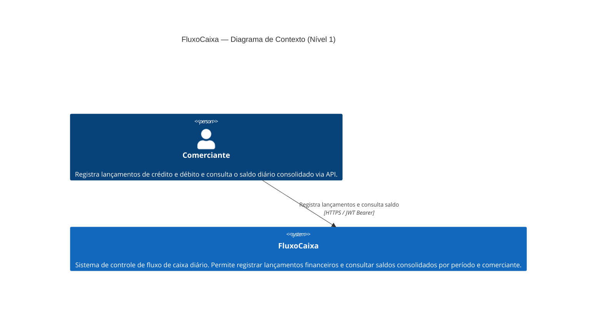

# C4 — Nível 1: Diagrama de Contexto do Sistema

## Diagrama

## Descrição dos Elementos

| Elemento | Tipo | Descrição |
|---|---|---|
| Comerciante | Persona | Usuário final do sistema. Autentica via JWT (role `Merchant`). Acessa exclusivamente seus próprios lançamentos e saldos — resource-level authorization via claim `merchantId`. |
| FluxoCaixa | Sistema de Software | Processa lançamentos em tempo real (disponibilidade garantida) e consolida saldos diários de forma assíncrona (consistência eventual). |

## Decisões Arquiteturais Relevantes neste Nível

- O sistema **nunca fica indisponível para lançamentos**, mesmo que o processamento do consolidado falhe (ADR-001).
- Todo acesso é protegido por **JWT HS256** com expiração curta e resource-level authorization (ADR-005).
- Não há sistemas externos de autenticação — JWT é emitido pelo próprio serviço de Lançamentos.
