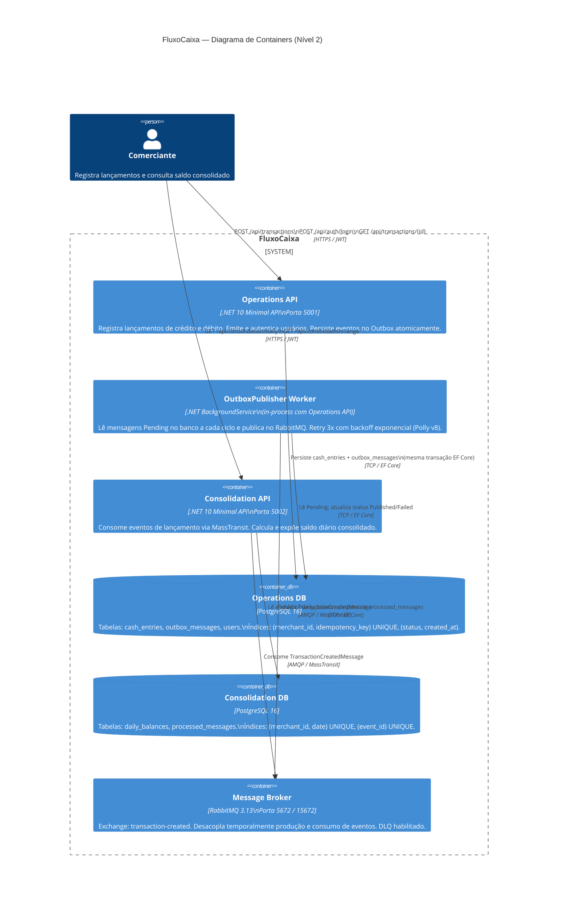

# C4 — Nível 2: Diagrama de Containers

## Diagrama

## Descrição dos Containers

| Container | Tecnologia | Responsabilidade Principal |
|---|---|---|
| Operations API | .NET 10 Minimal API | Registrar lançamentos, autenticar usuários, expor endpoints REST |
| OutboxPublisher Worker | .NET BackgroundService | Publicar eventos pendentes no broker com retry (co-residente na Operations API) |
| Consolidation API | .NET 10 Minimal API | Consumir eventos, calcular saldo diário, expor endpoints de consulta |
| Operations DB | PostgreSQL 16 | Persistência de lançamentos, outbox e usuários |
| Consolidation DB | PostgreSQL 16 | Persistência de saldos consolidados e controle de idempotência |
| Message Broker | RabbitMQ 3.13 | Transporte assíncrono de eventos entre os dois serviços |

## Decisões Arquiteturais Relevantes neste Nível

- **Sem Redis**: PostgreSQL com índices adequados é suficiente para 50 RPS — Redis documentado como evolução para escala maior (ADR-004).
- **Sem API Gateway**: rate limiting implementado diretamente em cada API (ADR-009 — evolução futura).
- **Bancos separados**: cada serviço tem seu próprio banco — bounded contexts com schema isolado (tabelas de histórico de migração separadas: `__ef_migrations_history_ops` e `__ef_migrations_history_cons`).
- **OutboxWorker co-residente**: roda in-process com a Operations API para compartilhar o mesmo `DbContext` sem lock distribuído.
