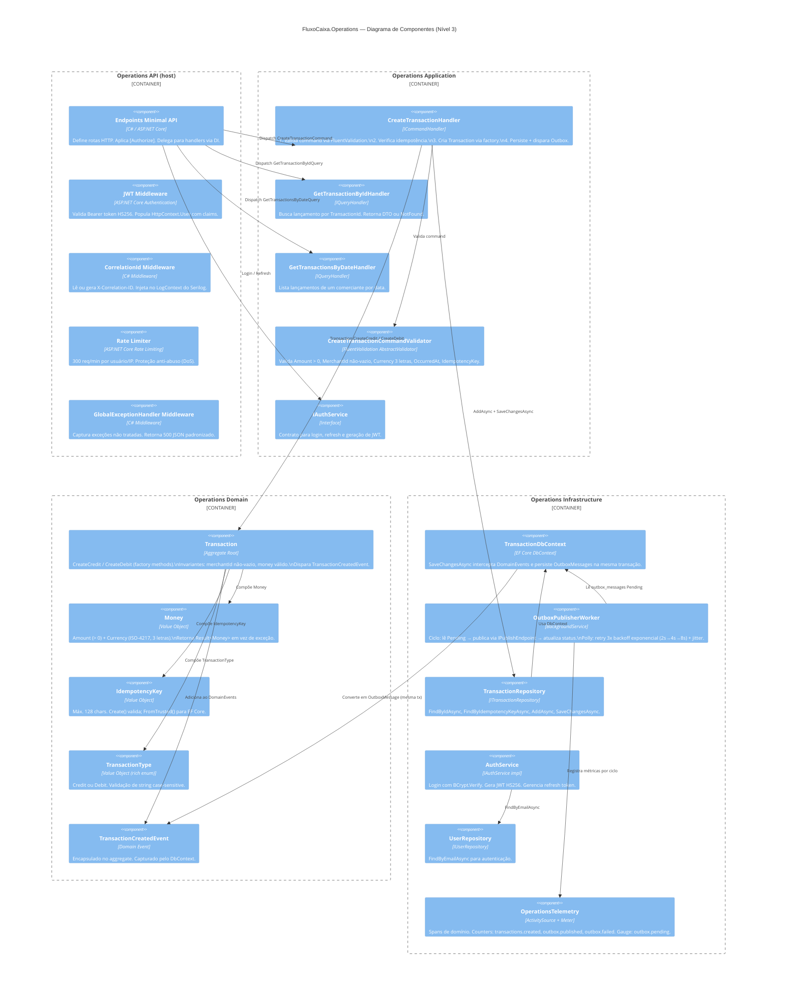

# C4 — Nível 3: Diagrama de Componentes — Operations Service

## Diagrama



## Fluxo Principal: POST /api/transactions

```
Cliente → [JWT Middleware] → [Rate Limiter] → [CorrelationId] → Endpoint
  → CreateTransactionHandler
      → Validator (FluentValidation)
      → ITransactionRepository.FindByIdempotencyKeyAsync (check idempotência)
      → Transaction.CreateCredit/CreateDebit (domain factory)
      → ITransactionRepository.AddAsync
      → DbContext.SaveChangesAsync
          → Intercepta TransactionCreatedEvent
          → INSERT cash_entries + INSERT outbox_messages (mesma transação)
  ← 201 Created + TransactionDto

[Em background]
OutboxPublisherWorker
  → SELECT outbox_messages WHERE status = 'Pending'
  → IPublishEndpoint.Publish<TransactionCreatedMessage>
  → UPDATE outbox_messages SET status = 'Published'
  → [RabbitMQ] → Consolidation API Consumer
```
